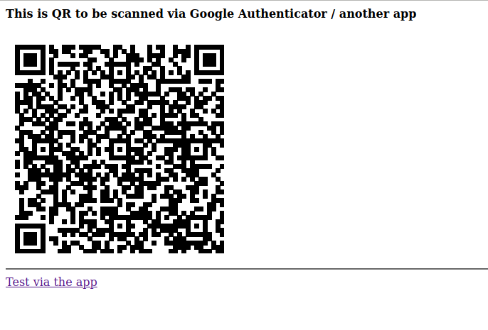

# OTP QR Demo

A demonstration on how to create own OTP authentication

## Usage

1. Install dependencies:

    ```shell script
    composer install
    ```

2. Run PHP files in your browser.

## Screenshots




